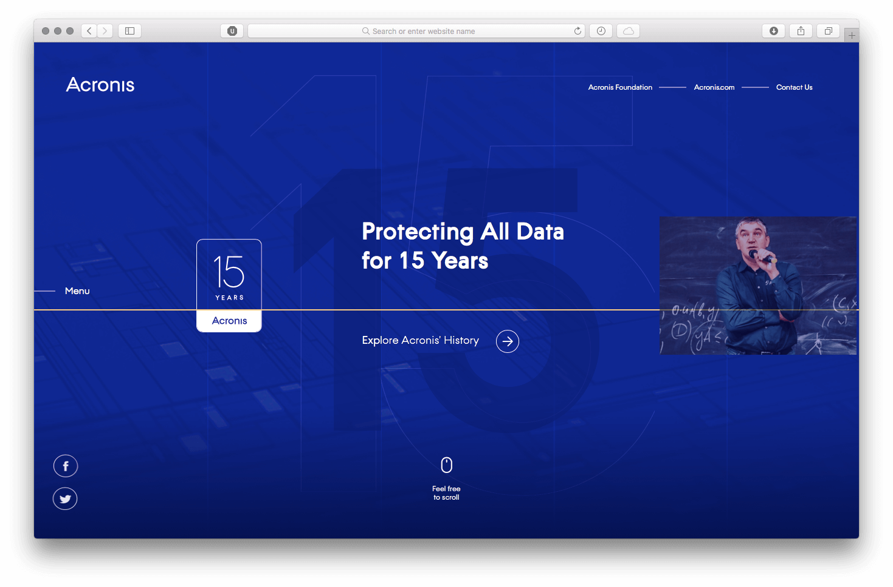
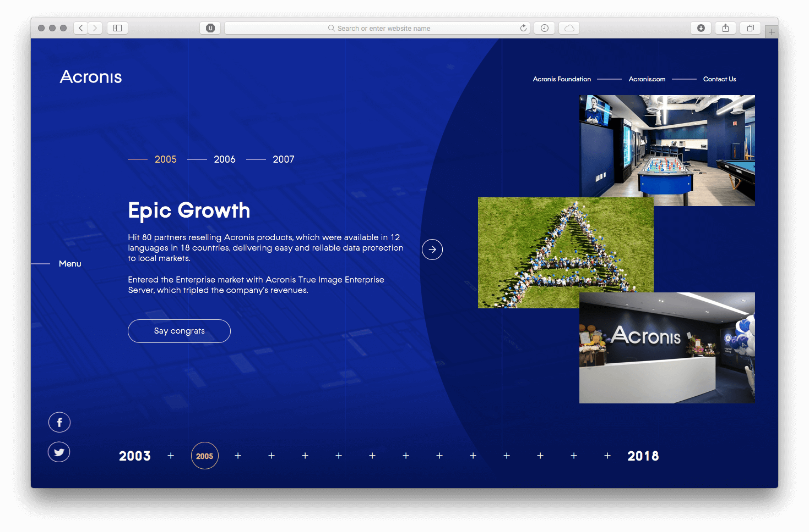
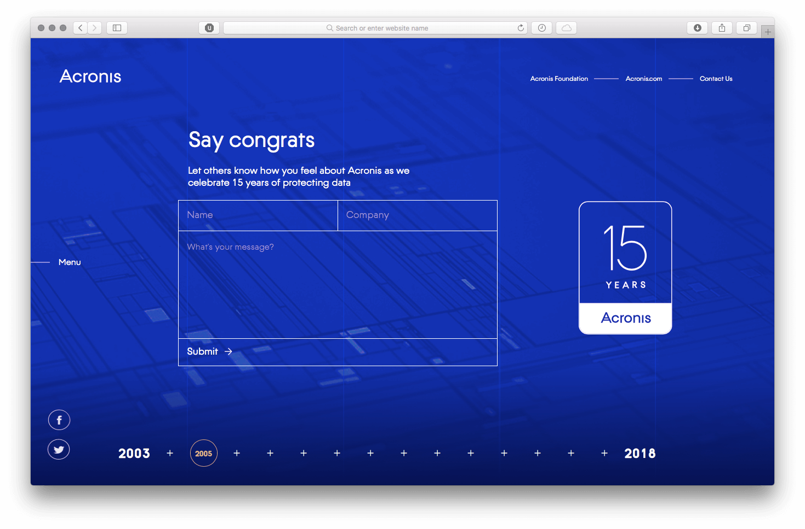
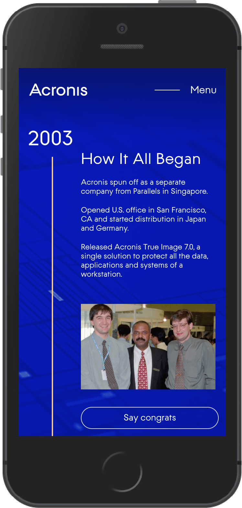

[{width="1469" height="968"}](/test/acronis-15/)

Сайт похож на презентацию, поэтому для верстки использовался [fullpage.js](https://github.com/alvarotrigo/fullPage.js). Чтобы контент менялся горизонтально при скролле, пришлось купить плагин [Scroll Horizontally](https://alvarotrigo.com/fullPage/extensions/scroll-horizontally.html).

[{loading=lazy width="1469" height="968"}](/test/acronis-15/#history/2005)

Из-за встроенных видео с ютуба страница грузилась очень долго, поэтому я сделала [lazy load](https://codepen.io/tutsplus/pen/RRVRro). Для большей скорости подключила [lazy load](https://github.com/alvarotrigo/fullPage.js#lazy-loading) и в fullpage.js.

Форма на сайте отправляет данные в гугл форму. Для этого нужно создать гугл форму с такими же полями, и скопировать атрибуты name у полей и action у формы с гугл формы на свою. Наиболее понятный туториал нашла на сайте [webjeda.com](https://blog.webjeda.com/google-form-customize/).

[{loading=lazy width="1469" height="968"}](/test/acronis-15/#feedback)

На мобилках fullpage.js не используется, и история компании показывается на одной странице:

{loading=lazy width="374" height="784"}
