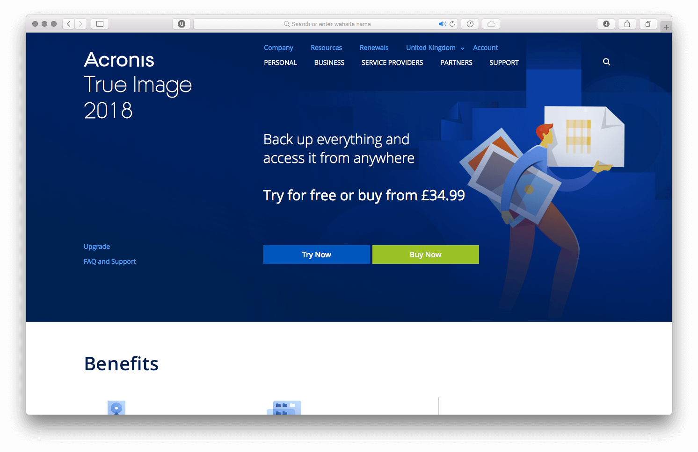
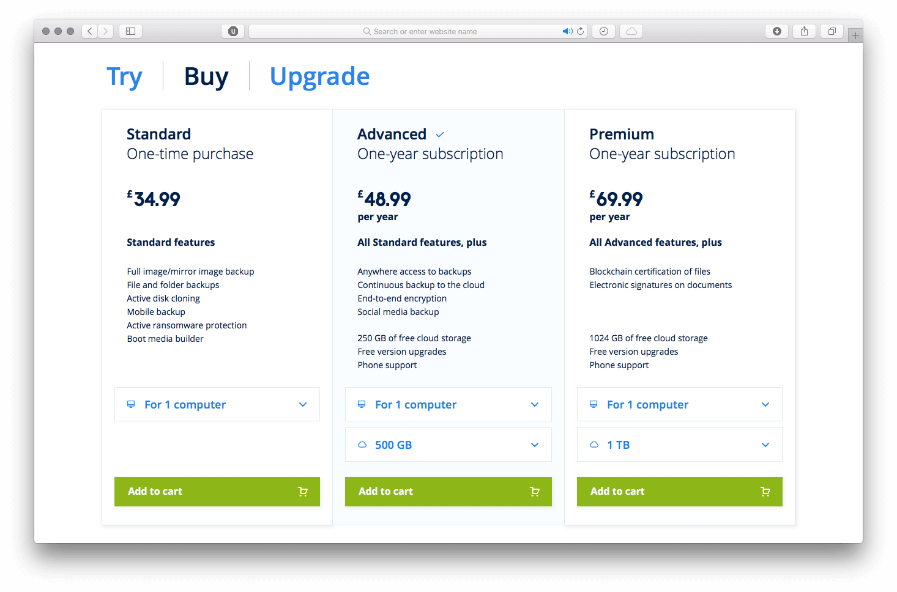
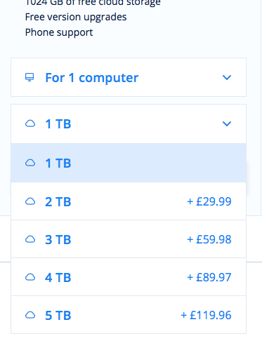
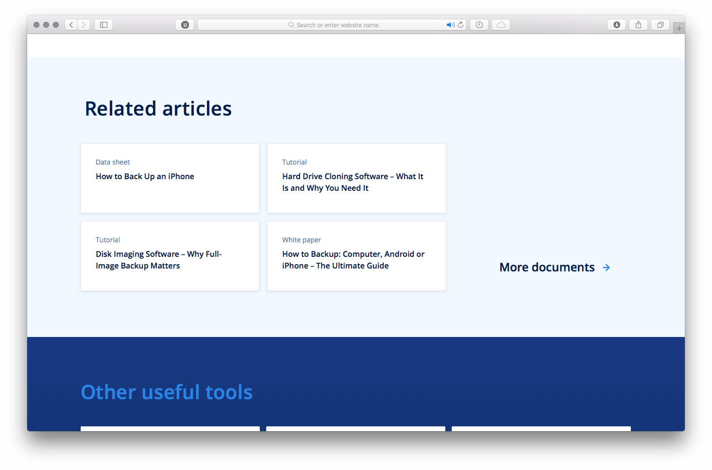

Для A/B теста мне нужно было сверстать страницу, используя настоящие данные.

Самым сложным на этой странице был калькулятор цен:

Логика калькулятора не зависит от разметки и сделана отдельным классом. Непосредственно к ДОМу я её привязала через отдельный контроллер. Так логику можно будет привязать к любому интерфейсу и еще проще тестировать.

Данные для цен нужно было брать в json. Для каждой комбинации количества компьютеров и памяти есть своя цена, так же нужно учитывать возможные промокоды и опцию апгрейда. Кнопка добавления в корзину — это на самом деле ссылка с параметром выбранного продукта в урле.

Еще нужно рассчитывать стоимость каждого дополнительного терабайта или компьютера:

При открытии полного списка фич есть красивая анимация:

https://youtu.be/e2MBM1X31Hs

Блоки-карточки в мобильной версии превращаются в слайдеры:

