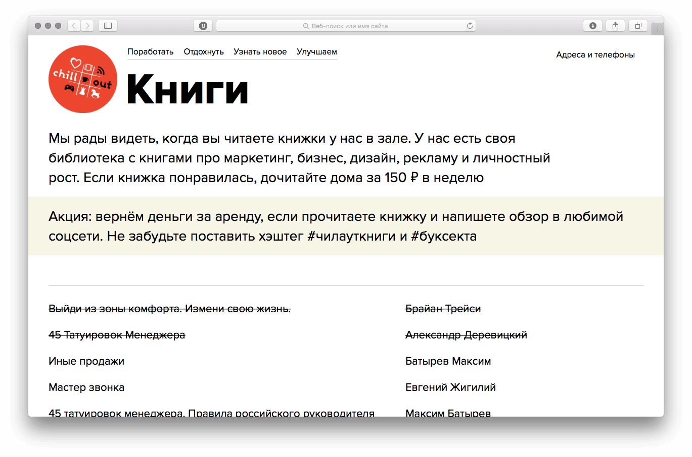
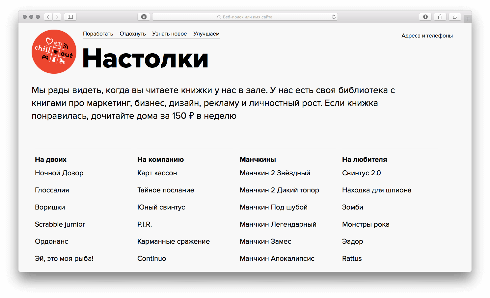

Чилаут — антикафе с настольными играми и библиотекой. Администраторы отмечают в гугл-таблицах, у кого на руках книги, и в каком состоянии настольные игры: хватает ли фишек, в порядке ли карточки.

Читатели берут книги домой под залог. На сайте мы решили показывать, какие книги свободны и какие игры есть в антикафе.

Раньше гугл-таблицы как бекенд казались шуткой. Оказалось, нет. Работать с ними удобно, если использовать сторонние библиотеки. Руками разбирать таблицы — запарно. Для страницы я вытащила данные из гугла и сверстала шаблон.

У книг, которые ещё не вернули, название зачёркнуто:

[{loading=lazy width="1369" height="906"}](/test/chillout/books.html)

Настолки мы делим по числу участников или по категориям. В таблице сортировки нет, поэтому я сортирую записи руками уже в браузере скриптом. Сложнее всего было сортировать игры одновременно и по количеству участников, и по категории:

[{loading=lazy width="1487" height="906"}](/test/chillout/board-games.html)
