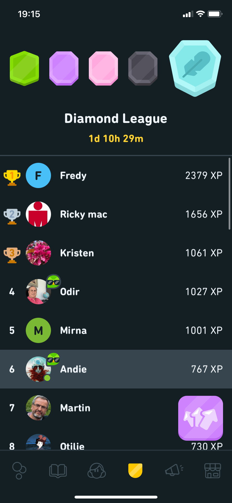

В 2020 году я занималась немецким почти каждый день — стрейк в 214 дней! Обычно утром, сразу как проснулась, чтобы делать что-то полезное, а не залипать в реддит)

{loading=lazy width="379" height="342"}

Моя ближайшая цель — прочитать первую книгу Гарри Поттера на немецком ближе не становится, но короткие рассказы на Дуолинго читать уже получается. Читать их интереснее, чем делать упражнения, к тожу же они дают больше XP:

{loading=lazy width="414" height="896"}

Благодаря большему количеству XP я наконец-то прошла в последнюю Diamond лигу:

{loading=lazy width="414" height="896"}
