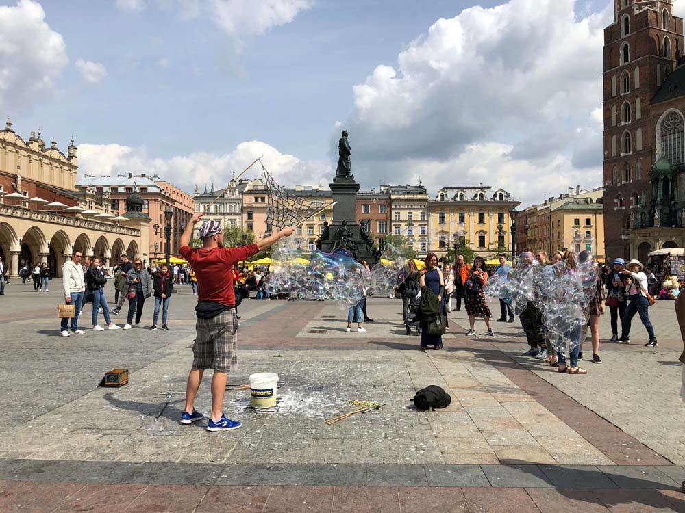

В внутреннем дворике Airbnb на лестничных оградах сидели кованые птицы:

В городе много оплетенных плющом стен:

Город вообще очень зеленый:

В трамваях есть удобные дисплеи с указателями остановок. Есть старые:

и новые:

Еще видели то ли электробус, то ли автономный троллейбус:

У кресел забавный паттерн

У Вавельского замка одна из стен вся в плашках

По этой брусчатке было очень больно ходить, даже в кроссовках. Плюсом было то, что ходить там можно одному.

Реконструированный памятник:

Вид на главную площадь с башни костела:

На площади бывают люди, пускающие мыльные пузыри всем на радость:

Витраж в одной из башен:

Красота:

