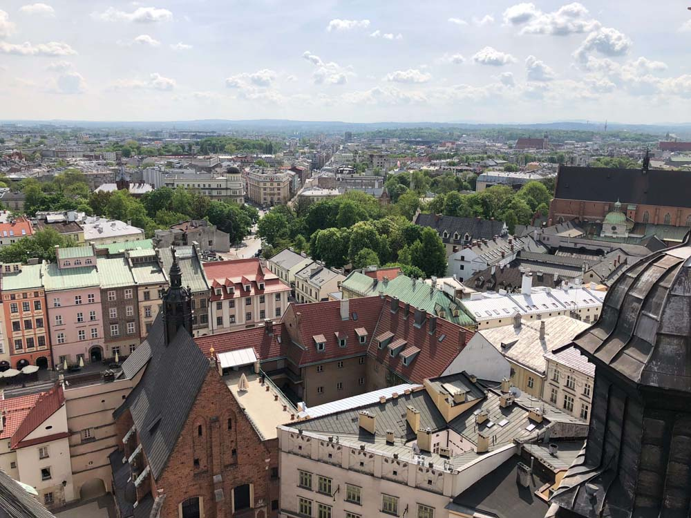

В внутреннем дворике Airbnb на лестничных оградах сидели кованые птицы:

{loading=lazy width="1000" height="750"}

{loading=lazy width="750" height="1000"}

В городе много оплетенных плющом стен:

{loading=lazy width="750" height="1000"}

{loading=lazy width="750" height="1000"}

{loading=lazy width="1000" height="750"}

Город вообще очень зеленый:

{loading=lazy  width="1000" height="750"}

В трамваях есть удобные дисплеи с указателями остановок. Есть старые:

{loading=lazy width="1000" height="750"}

и новые:

{loading=lazy width="1000" height="750"}

Еще видели то ли электробус, то ли автономный троллейбус:

{loading=lazy width="1000" height="750"}

У кресел забавный паттерн

{loading=lazy width="1000" height="750"}

У Вавельского замка одна из стен вся в плашках

{loading=lazy width="1000" height="750"}

{loading=lazy width="750" height="1000"}

По этой брусчатке было очень больно ходить, даже в кроссовках. Плюсом было то, что ходить там можно одному.

{loading=lazy width="1000" height="750"}

Реконструированный памятник:

{loading=lazy width="1000" height="750"}

Вид на главную площадь с башни костела:

{loading=lazy width="1000" height="750"}

На площади бывают люди, пускающие мыльные пузыри всем на радость:

{loading=lazy width="1000" height="750"}

{loading=lazy width="1000" height="750"}

Витраж в одной из башен:

{loading=lazy width="1000" height="750"}

Красота:

{loading=lazy width="750" height="1000"}
