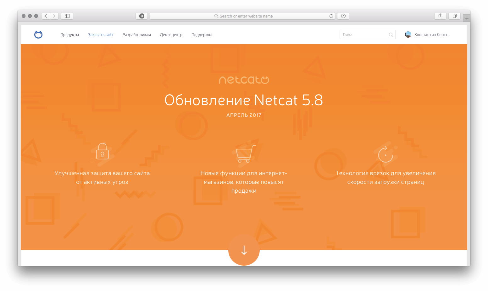
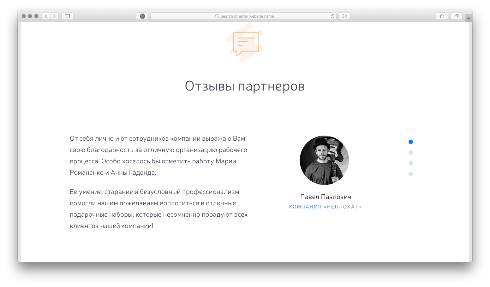

Ширина макета была в 1600 пикселей. Нужно было сделать адаптив не только в ширину, но и в высоту, чтобы контент выглядел гармонично как на ноутбуках, так и на больших мониторах.

[{width="1552" height="929"}](/test/new-netcat-update/update.html)

При скролле анимируются свг-картинки. О том, как такие анимации работают, рассказали в [css-tricks](https://css-tricks.com/svg-line-animation-works/). Некоторые картинки пришлось переделать, чтобы они были сделаны через `stroke`, а не `fill`. Анимировать их было интересно, потому что иногда с первого раза получалось красиво, а иногда нужно было долго подбирать значения. В IE такая анимация толком не работала, поэтому там сразу показывается целая картинка.

https://youtu.be/faFw2ef5ES4

Для показа отзывов использовала фотораму. Нужно было учесть, что длина отзывов может быть разной.

{loading=lazy width="1552" height="910"}
