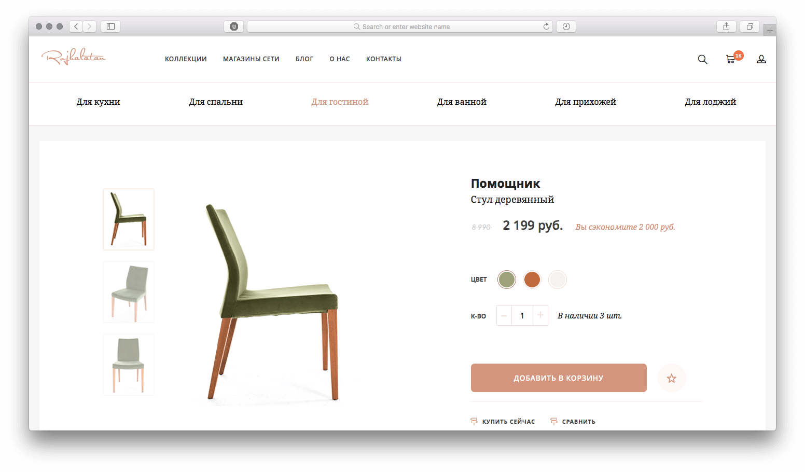
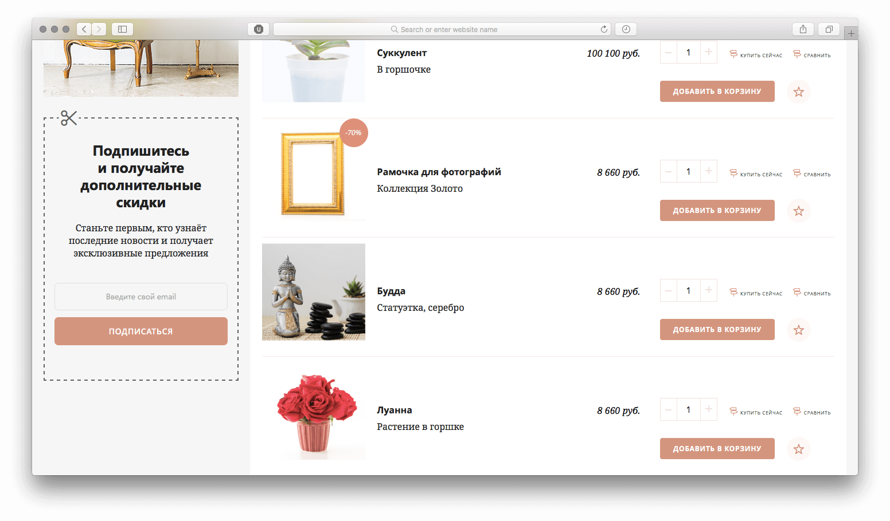
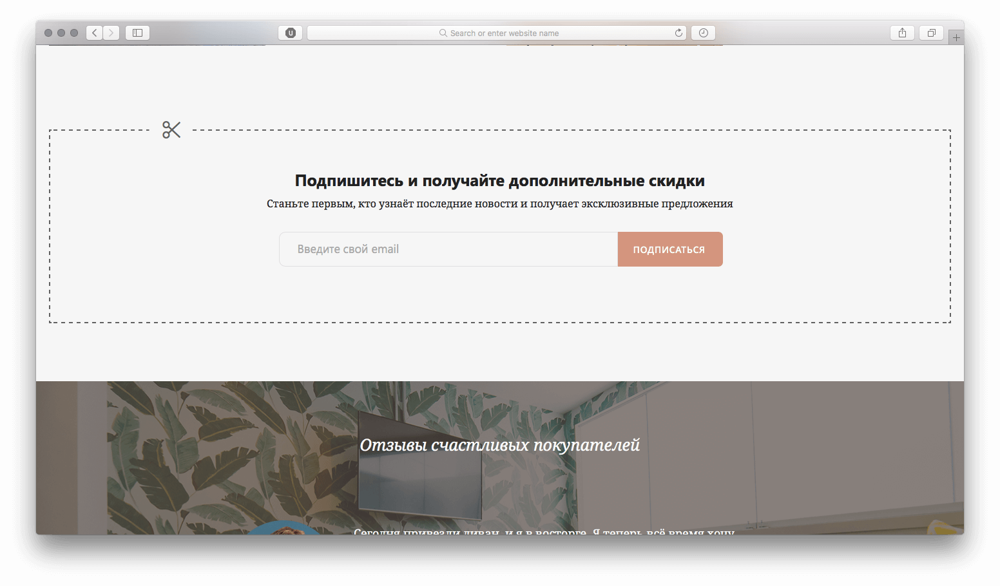

Главным требованием при верстке была модульность. Файлы разметки и стилей были отдельными у каждого блока. Для адаптива использовали [CSS Element Queries](https://github.com/marcj/css-element-queries), то есть адаптив зависел не от ширины экрана, а от ширины элемента.

Плюсом является то, что у можно вставлять один и тот же блок в разные места сетки, не меняя стилей:

[{loading=lazy}](/test/netcat_tpl/catalog.html)

[{loading=lazy}](/test/netcat_tpl/index.html)
