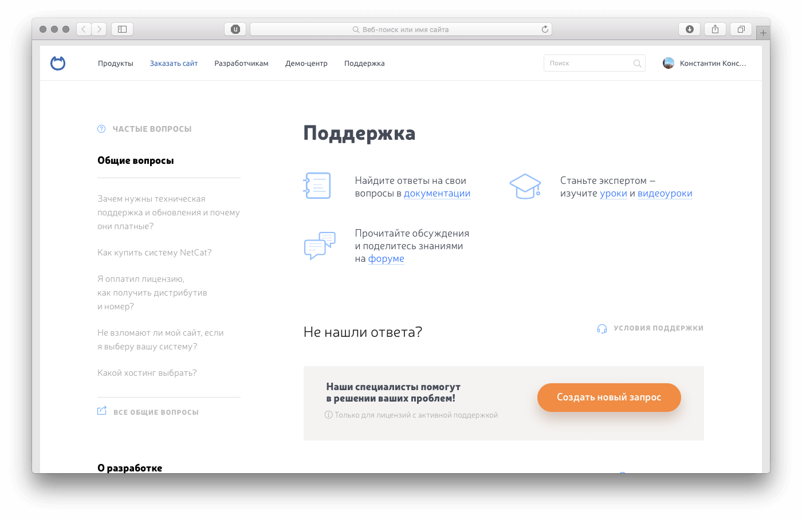
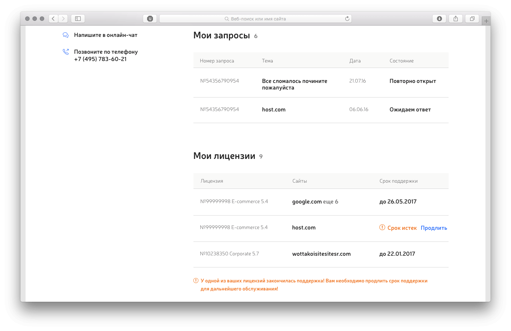
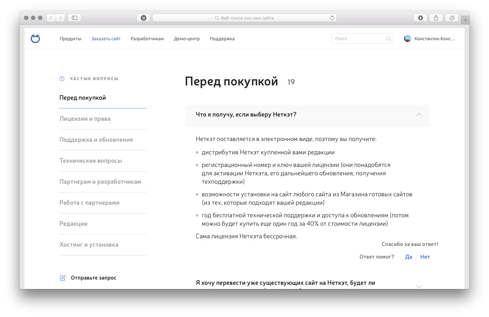
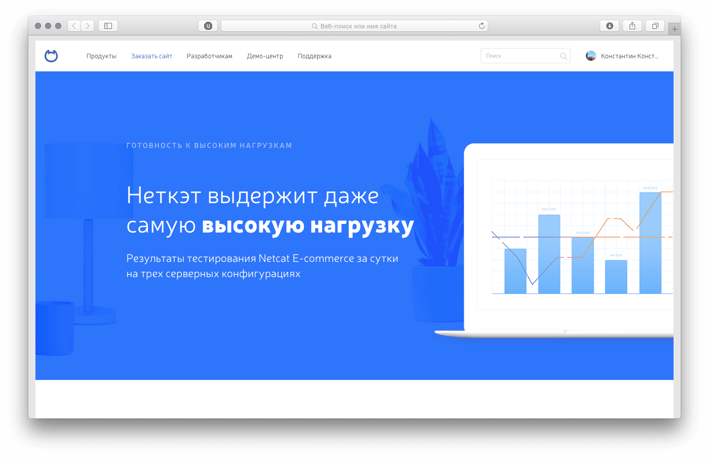
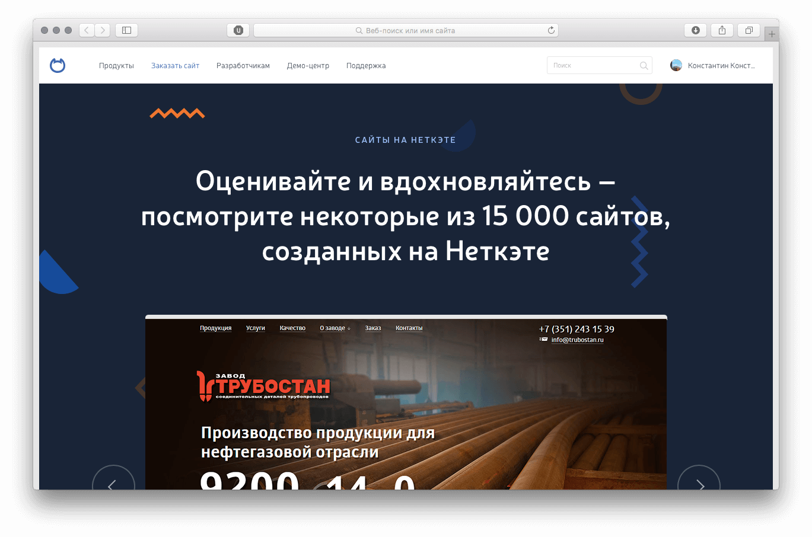
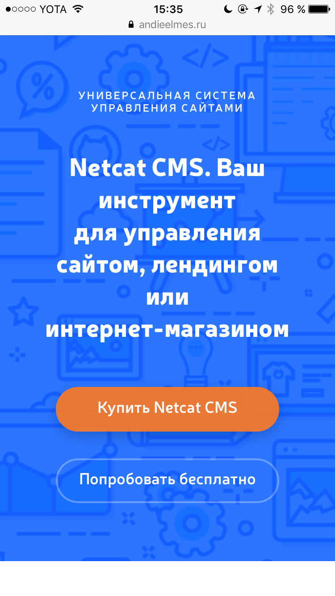

Верстка страницы поддержки Неткэта — моя первая продуктовая задача. Я полчаса расспрашивала дизайнера о роли каждого элемента на странице. Кнопочки, таблицы, адаптив, где ссылка, а где нет — старалась узнать всё. Поэтому получилось сверстать её правильно с первого раза.

Ожидала, что будут правки, но их не было.

[{ loading=lazy }](/test/netcat_projects/support.html)

Интереснее всего было верстать таблицы. Мои вкусы очень специфичны — с удовольствием подбирала интерлиньяж и поля, пока таблица не встала ровно по макету. На декстопе они выглядят так:

{ loading=lazy }

А на телефоне так:

{ loading=lazy }

Дизайнер предложила сделать еще одну страницу, а потом еще одну... Так я и верстаю страницы Неткэта уже два месяца.

Страница базы знаний похожа на страницу поддержки:

[{ loading=lazy }](/test/netcat_projects/support-1.html)

Страницу нагрузок нужно было сверстать за день:

[{ loading=lazy }](/test/netcat_projects/loads.html)

При верстке страницы портфолио использовала фотораму (с кастомными кнопками) и позаботилась о трафике. При сворачивании блоков я их не удаляю, а прячу, что не нужно было загружать их заново.

[{ loading=lazy }](/test/netcat_projects/portfolio.html)

При загрузке страницы зигзаги на фоне «рисуются». Анимация завязана на свойство stroke-dashoffset элемента polyline.

Ещё работала с чужим кодом — переделывала анимацию и адаптив главной страницы Неткэта.

[{ width="375" height="667" loading=lazy }](/test/netcat_main--adaptive/)

Свежих исходников не было, страница успела поменяться. Чтобы вытянуть код страницы, установила wget.
Контент веб-страницы, со всеми зависимостями и файлами скачивается так:

```
wget -p -k https://url
```

Разбираться в существующей разметке и коде, отвечающем за отбор блоков, готовых к анимации, было сложно и непривычно, но интересно.
