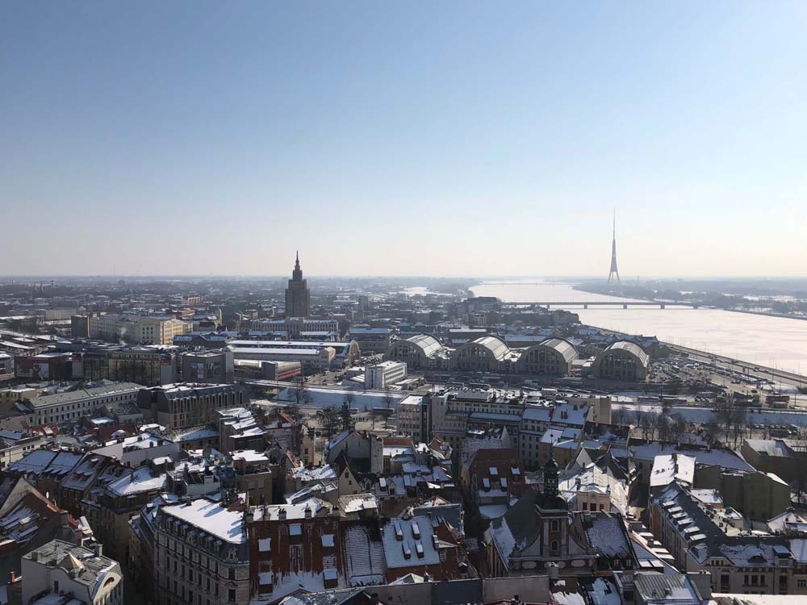
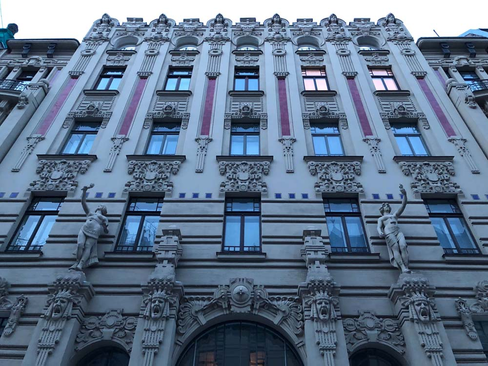
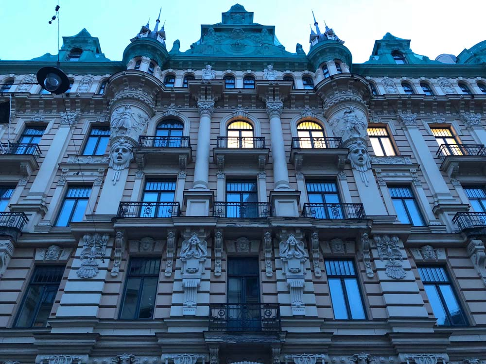
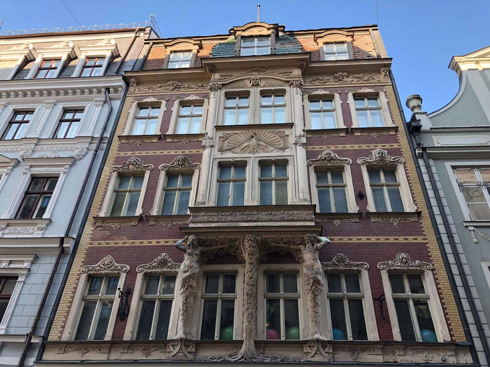
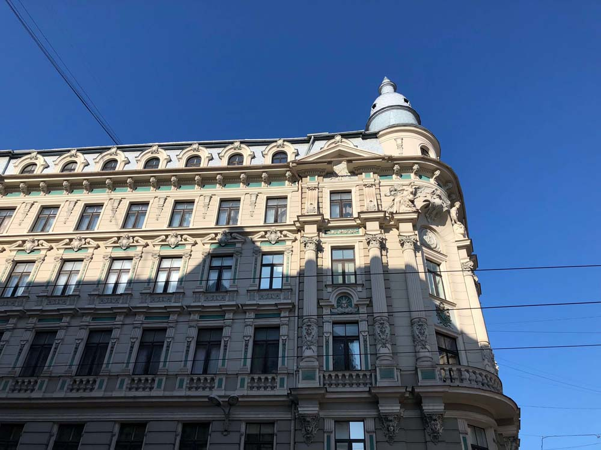
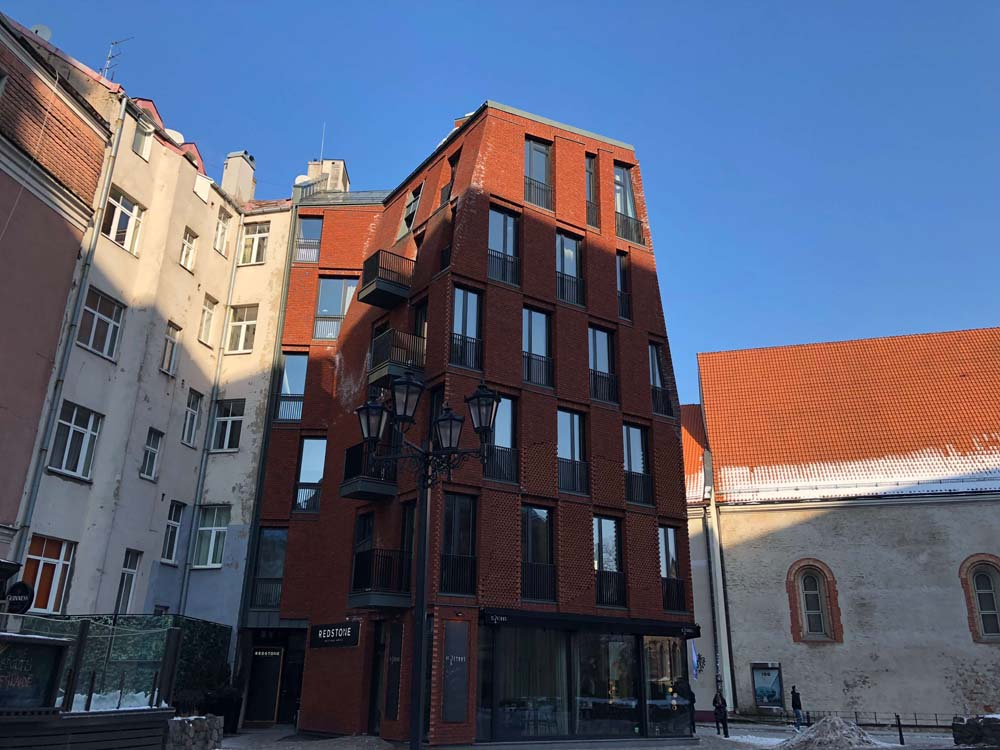
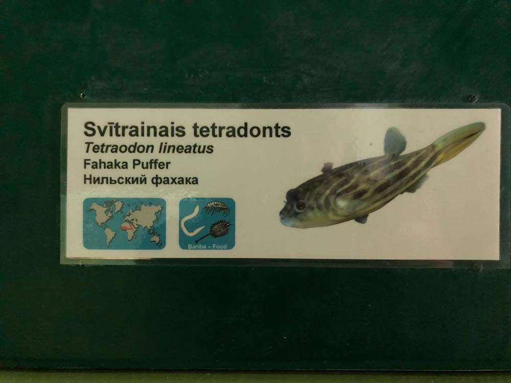
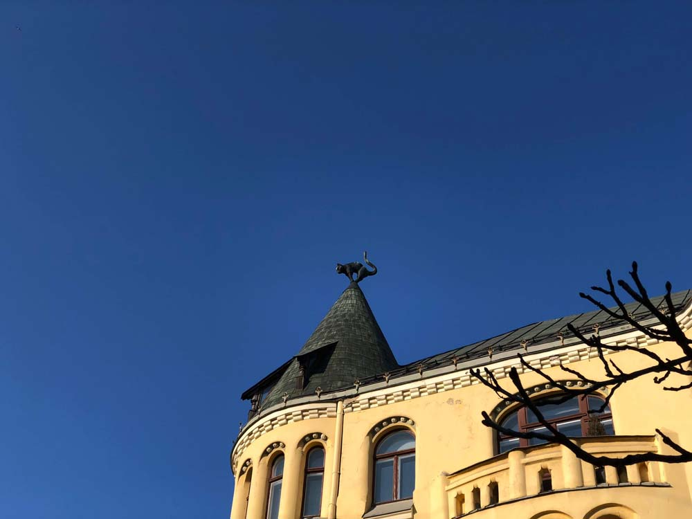

{ loading=lazy }

В Ригу я ездила на автобусе. Непривычно видеть столько казино по пути, в Литве и Латвии они на каждом шагу.

Здесь офигительная архитектура (самая красота на улице Альберта):

{ loading=lazy }

{ loading=lazy }

{ loading=lazy }

{ loading=lazy }

{ loading=lazy }

{ loading=lazy }

Деревянные здания:

{ loading=lazy }

Стрит-арт:

{ loading=lazy }

Одно из самых старых зданий Риги, 1646 год:

{ loading=lazy }

Современная архитектура:

{ loading=lazy }

Еще в Риге есть классный зоопарк. До него можно доехать на трамвае, заодно осмотрев почти весь город.

{ loading=lazy }

Мне больше всего понравились муравьи. Рядом есть лупа:

{ loading=lazy }

{ loading=lazy }

По территории ходят коты:

{ loading=lazy }

Есть забавные рыбки:

{ loading=lazy }

{ loading=lazy }

Жирафы:

{ loading=lazy }

И фламинго (фламинго отбирали еду у пеликанов):

{ loading=lazy }

Котики есть еще на шпилях:

{ loading=lazy }

Третье рижское общество взаимного кредита:

{ loading=lazy }

Мост:

{ loading=lazy }
