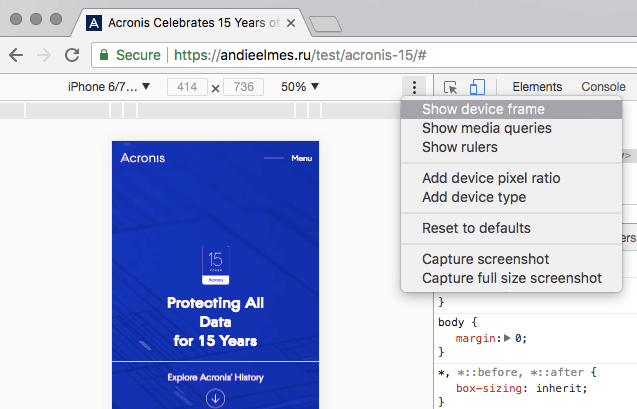

Раньше я пыталась делать скриншоты через фотошоп, накладывая скачанные из интернета мокапы айфонов. Это было сложно, нужно было их выравнивать и смотреть, чтобы не обрезался контент с боков. Иногда скриншот не влезал по размеру в мокап, приходилось подгонять.

Оказалось, что в Хроме есть просто офигенный тулбар мобильных девайсов. В нем можно посмотреть страницу на разных устройствах. А можно и сразу добавить еще и рамку соответствующего девайса:

И сделать скриншот сразу с рамкой, нажав на “Capture screenshot”!

