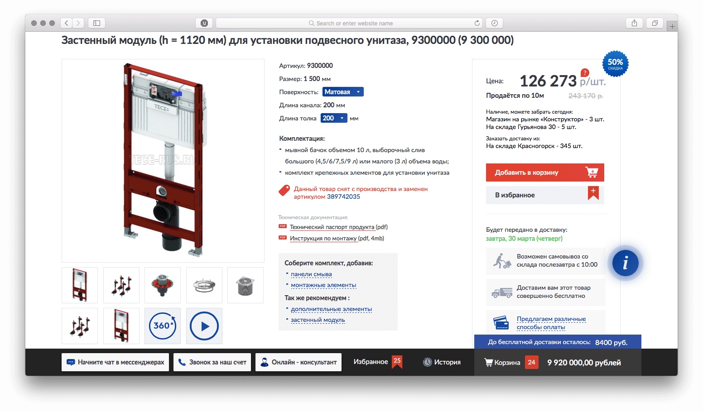
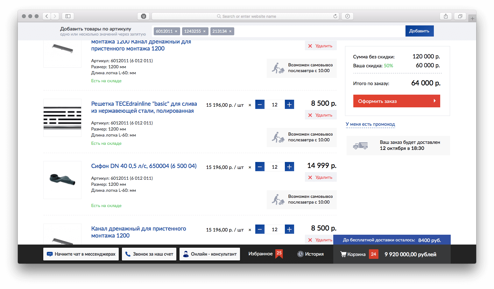
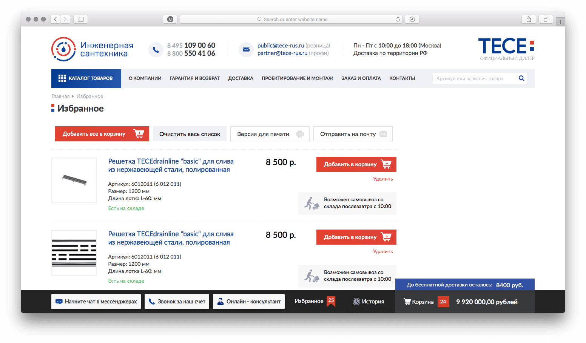
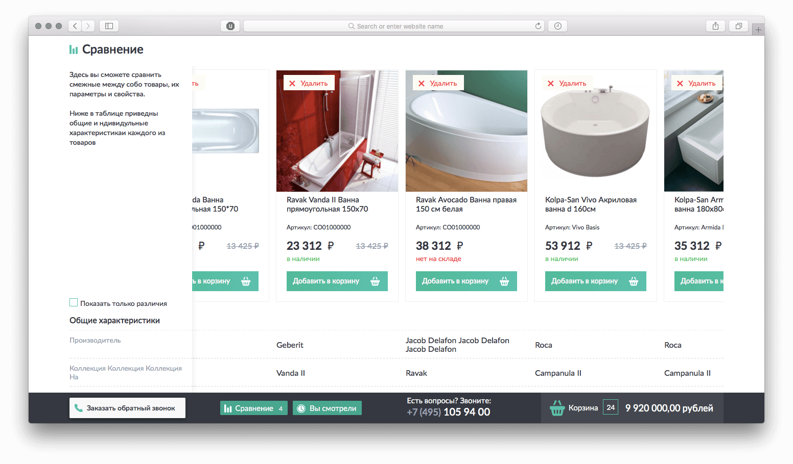

Это интернет магазины сантехники. У каждого товара есть много опций и вариантов.

На карточке товара можно посмотреть фотографии в 360 градусов и видео. Фото в 360 градусов сделано с помощью [Object2VR](https://ggnome.com/object2vr). В программе, которая склеивает фото, можно выбрать html в качестве вывода [результата](https://ggnome.com/wiki/HTML5_Output_%28Object2VR%29).

В корзине есть возможность добавить несколько товаров по артикулу. Поле и блок с итогом залипают сверху c помощью `position: fixed`, поэтому работает везде.

Список избранного можно распечатать или отправить на почту. Дизайнерам интерьеров так удобно показывать варианты техники клиентам.

В списке сравнения колонка заголовков прикреплена слева. Сложно было сделать так, чтобы строки заголовков совпадали по высоте с строками контента. Поэтому при адаптиве высота блоков постоянно пересчитывается.

