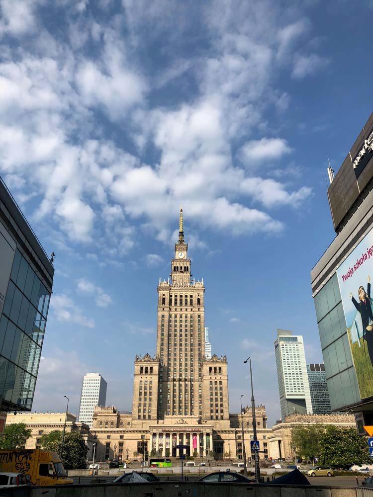
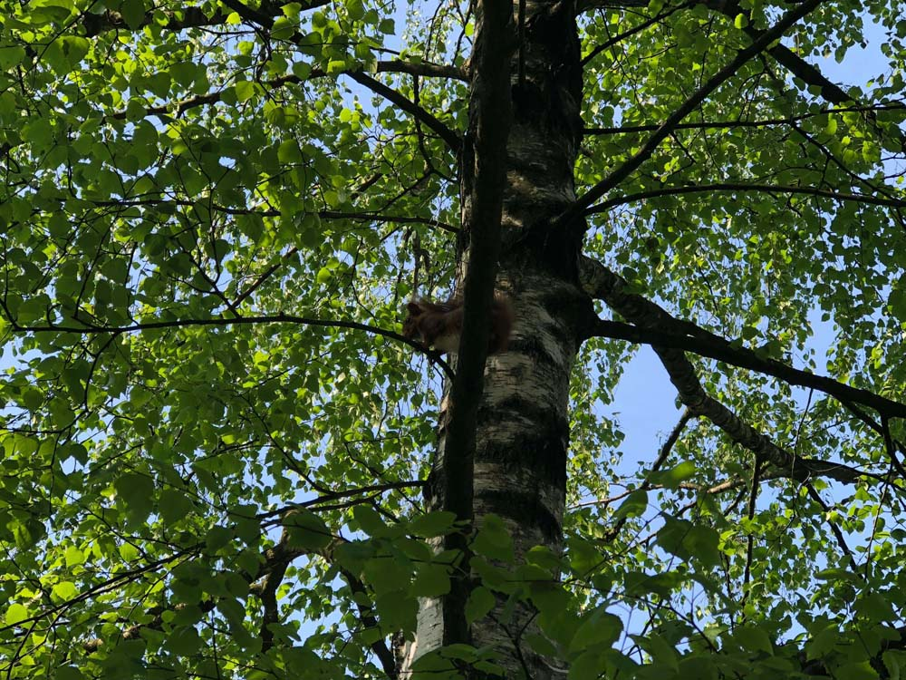
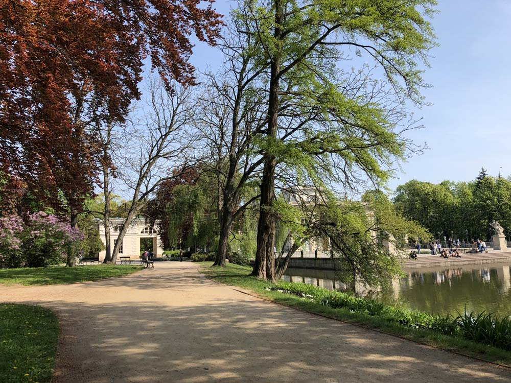
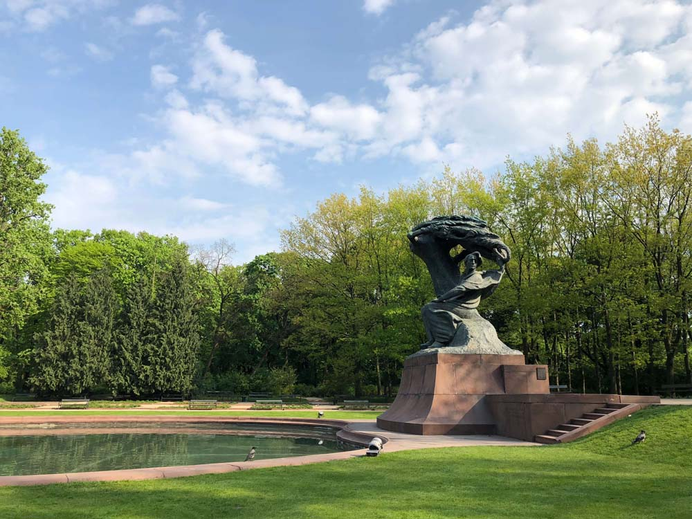
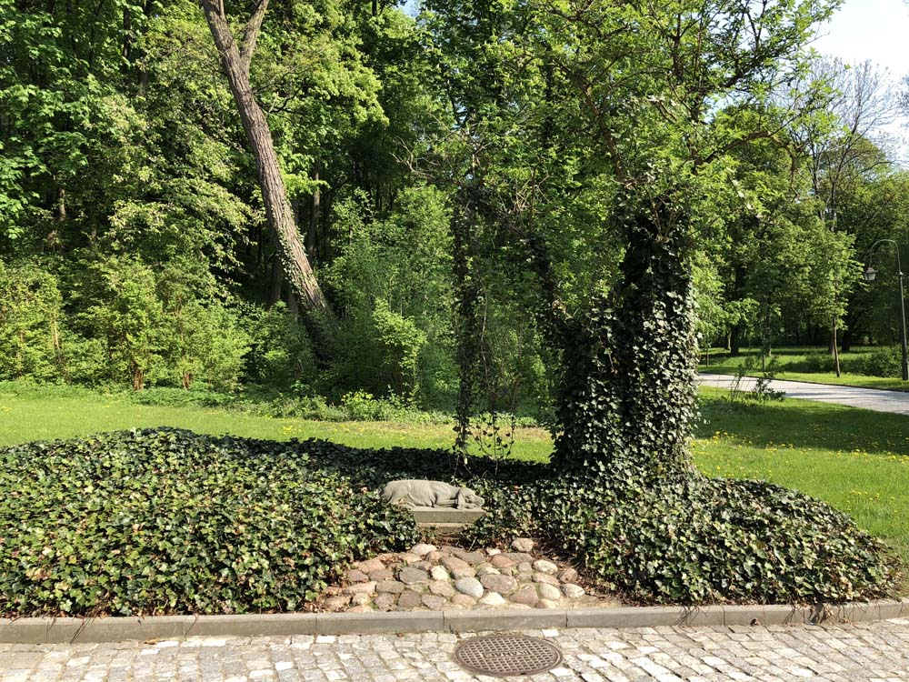
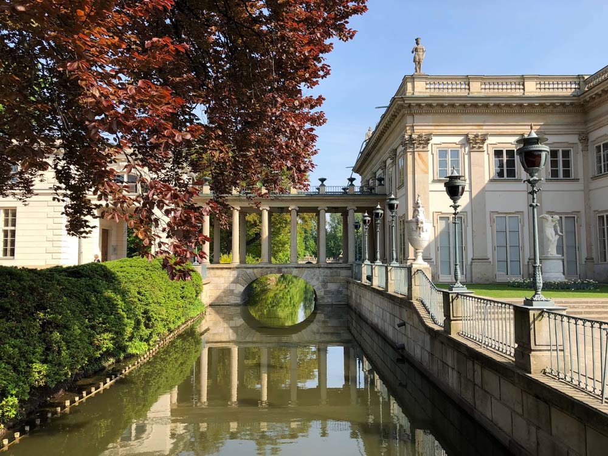
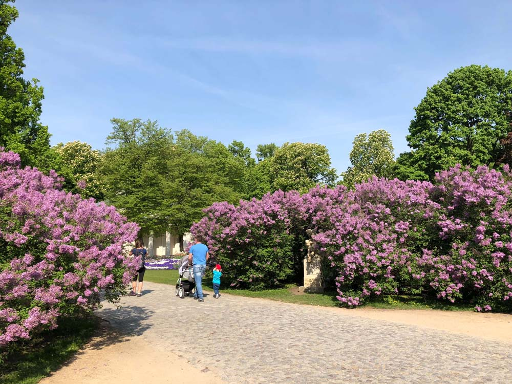

{loading=lazy width="750" height="1000"}

Здесь у меня была пересадка.

Сходили в парк Лазенки. Он занимает огромную площадь (76 га) прямо в центре города. Там свободно ходят павлины, белки и лисицы, а вороны докучают смотрителям, выпрашивая еду.

{loading=lazy width="1000" height="750"}

Некоторые дорожки мягкие, покрыты каким-то песком:

{loading=lazy width="1000" height="750"}

Есть пруд с памятником Шопену, где иногда устраивают концерты:

{loading=lazy width="1000" height="750"}

Памятник собачке:

{loading=lazy width="1000" height="750"}

Дворец на воде, восстановленный после WWII:

{loading=lazy width="1000" height="750"}

Деревья начинают рано цвести

{loading=lazy width="1000" height="750"}
