Если выйти на центральной станции, то сразу видно Palace of Culture and Science.

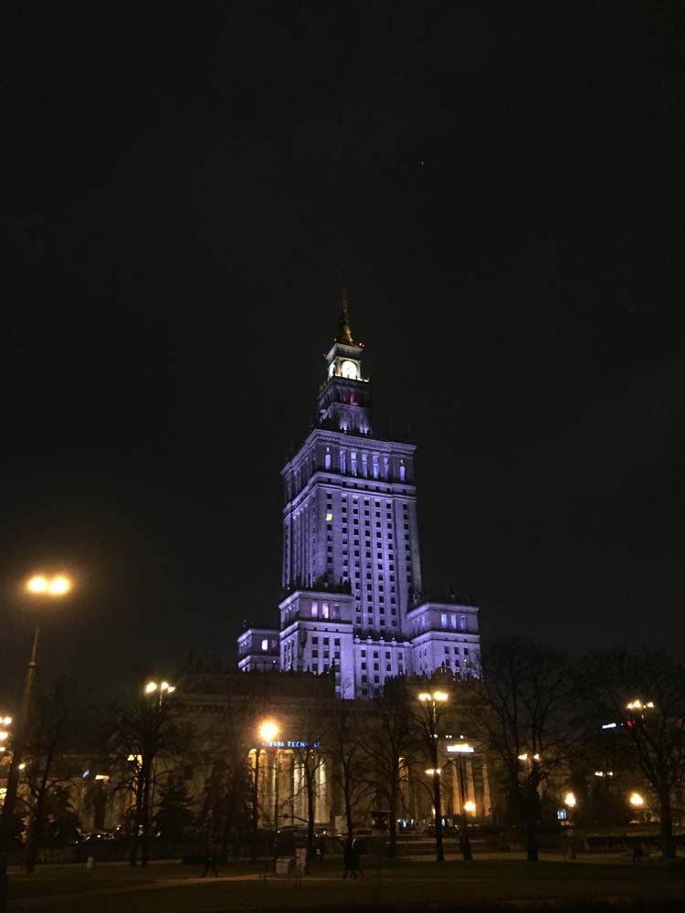{ loading=lazy }

Сейчас там куча учреждений, есть университет и даже кинотеатр. Внутри здание выглядит довольно потрепанным, есть советский лифт с лифтером, который поднимет тебя до смотровой площадки. В лифте душно, стоит вентилятор.

Прямо перед отелем был занимательный памятник куче мечей и, как мне казалось, железной дороге:

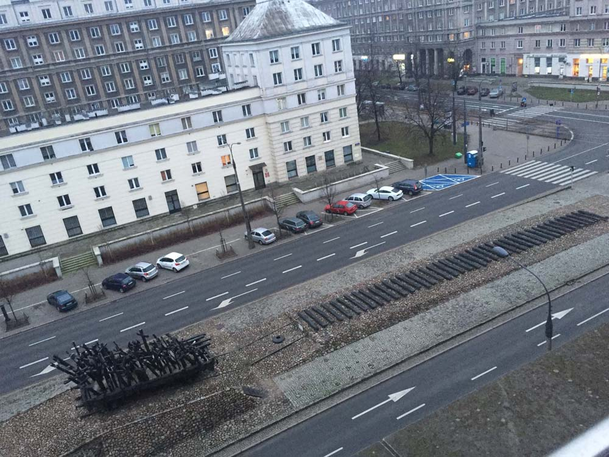{ loading=lazy }

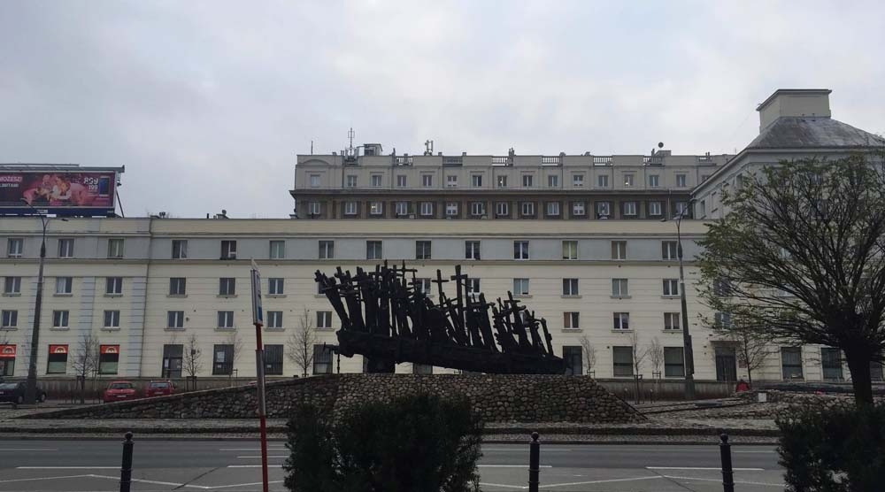{ loading=lazy }

На самом деле это памятник погибшим во время WWII. А мечи – это кресты. Железная дорога оказалась именно железной дорогой, так как множество людей погибло, оказавшись вывезенными из родных мест.

Над городом стоял туман:

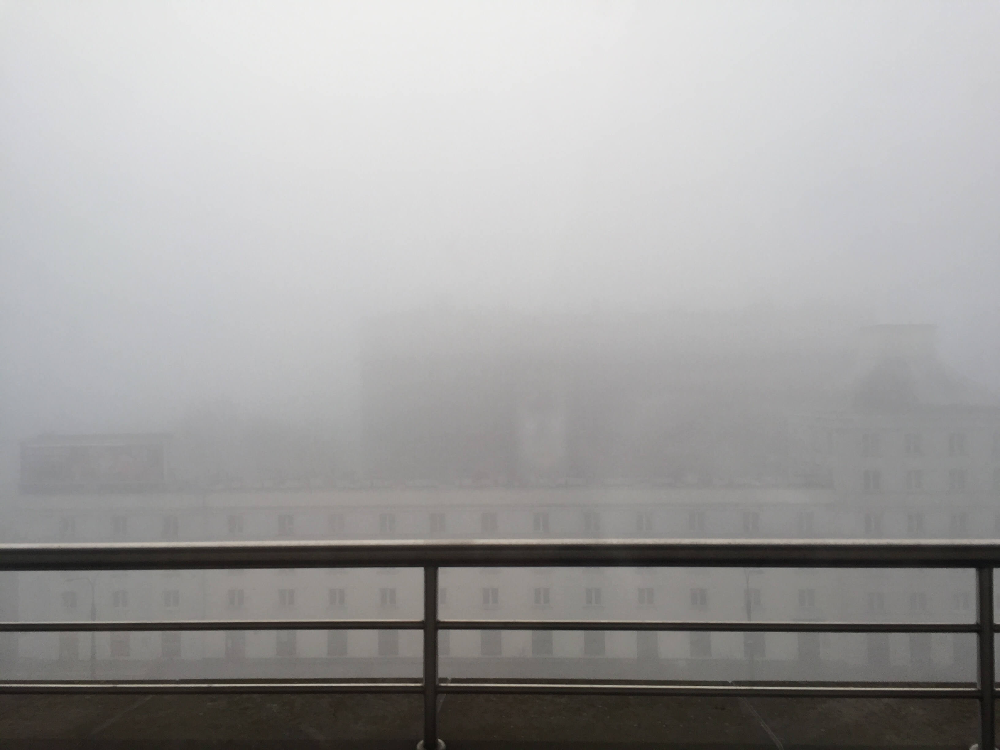{ loading=lazy }

Центр милый и красочный:

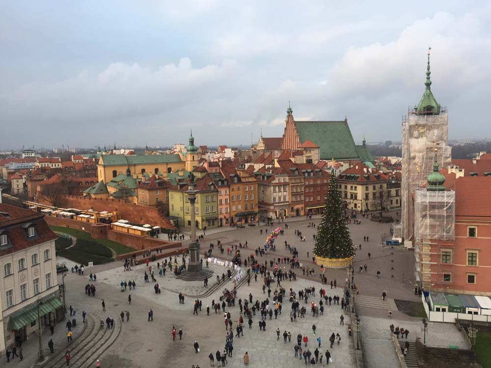{ loading=lazy }

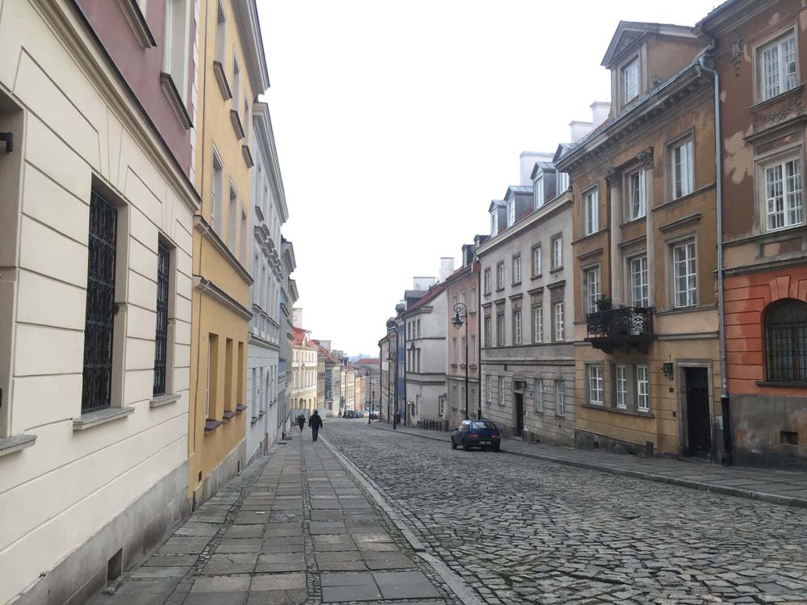{ loading=lazy }

Я еще никогда не видела таких прекрасных переходов:

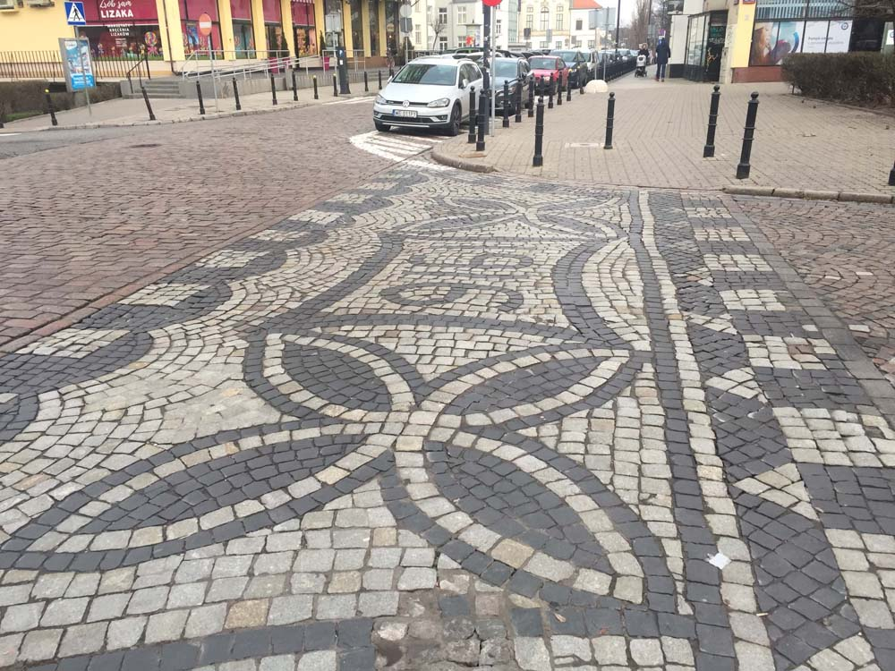{ loading=lazy }

Часто попадаются арки:

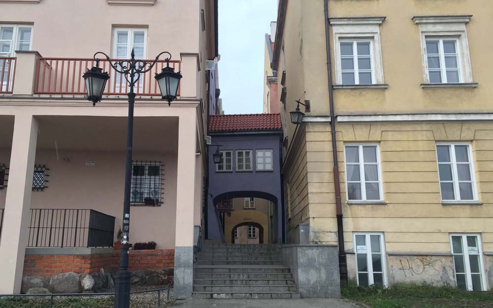{ loading=lazy }

У деревьев идеальные приствольные решетки:

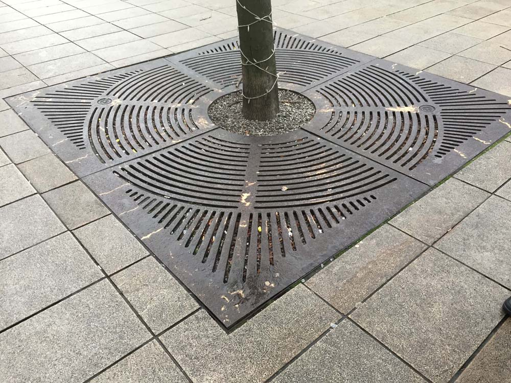{ loading=lazy }

А у фонарей цоколи:

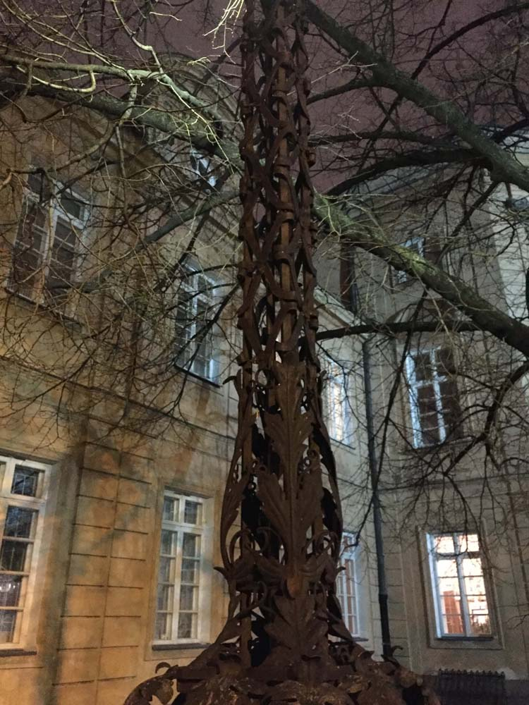{ loading=lazy }

Углы домов налезают на камни:

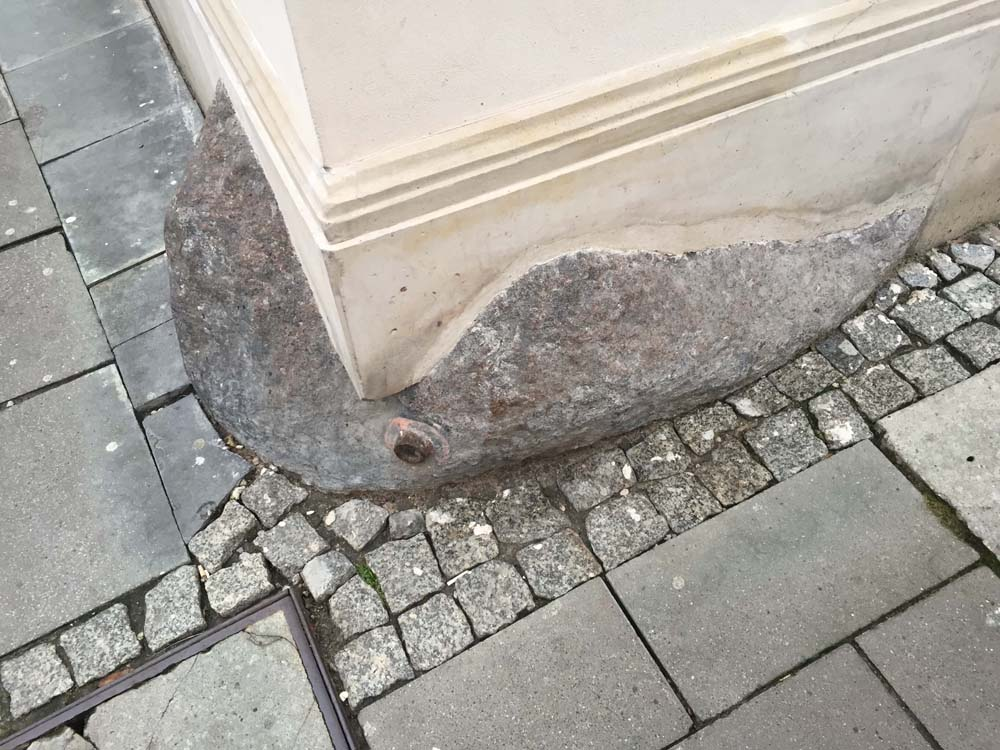{ loading=lazy }

Еще в Варшаве есть замечательный музей Коперника. В нем множество физических экспериментов, все можно потрогать и попробовать провести опыт самому.
